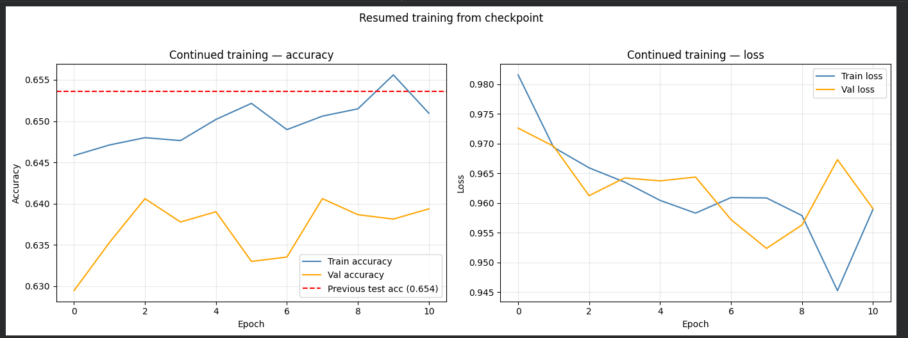
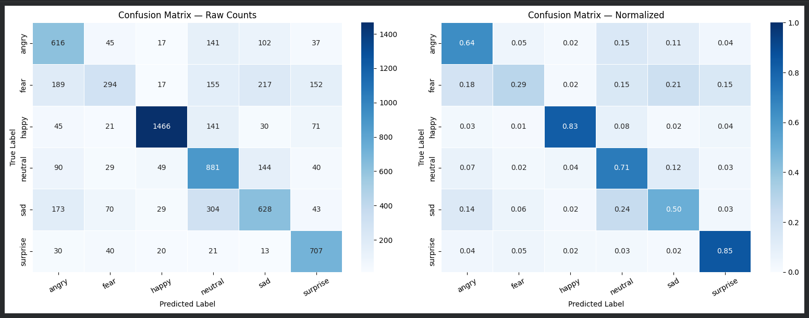

# Facial Emotion Recognition

A CNN that looks at a face and guesses what emotion it's showing — trained from scratch on FER-2013, wrapped in a Streamlit app, and also runnable locally with a live webcam feed.

**🔗 Try it here:** [facial-emotion-recognition.streamlit.app](https://facial-emotion-recognition-ptjvotserpv8ms2yhywwbw.streamlit.app/)

---

## Overview

I trained a CNN to recognize emotions from grayscale 48x48 facial images and built two ways to actually use it:

1. **Streamlit web app** (`app.py`) — take a photo, get an emotion prediction with confidence scores
2. **Local OpenCV demo** (`demo.py`) — real-time webcam detection on your own machine, no internet needed

The model predicts 6 emotions: **Angry, Fear, Happy, Neutral, Sad, Surprise**. I dropped `Disgust` from the original FER-2013 dataset early on — it had so few samples compared to the other classes that it was dragging down the model's overall performance more than it was worth keeping.

---

## Model Architecture

A sequential CNN with 3 convolutional blocks that get progressively deeper, feeding into a dense classification head:

```
Input (48x48x1, grayscale)
│
├── Conv Block 1 — Conv2D(32) → BatchNorm → Conv2D(32) → BatchNorm → MaxPool → Dropout(0.25)
├── Conv Block 2 — Conv2D(64) → BatchNorm → Conv2D(64) → BatchNorm → MaxPool → Dropout(0.25)
├── Conv Block 3 — Conv2D(128) → BatchNorm → Conv2D(128) → BatchNorm → MaxPool → Dropout(0.25)
│
├── Flatten
├── Dense(256) → BatchNorm → Dropout(0.5)
├── Dense(128) → Dropout(0.3)
└── Dense(6, softmax)
```

**A few decisions worth explaining:**
- **Two Conv2D layers per block** instead of one — this lets each block pull out richer features before the next pooling layer shrinks the spatial size
- **BatchNorm after every conv and dense layer** to keep training stable and converge faster
- **Dropout that increases as the network gets deeper** (0.25 → 0.5 → 0.3), since that's roughly where the model has the most parameters and the highest risk of overfitting
- **ReLU everywhere except the output**, which uses softmax to turn the final layer into a clean probability distribution over the 6 classes
- **Class weighting during training** — FER-2013 isn't evenly distributed across emotions, so without this the model would just learn to favor whichever class had the most examples

---

## Training

- **Dataset:** FER-2013 (Kaggle), 48x48 grayscale faces, 6 classes after dropping `disgust`
- **Approach:** trained with early stopping first, then resumed from the best checkpoint for 10 more epochs just to see if there was anything left on the table
- **Test set:** 7,067 images

### Training curves (the resumed run)

This chart is from the second training run — picking up from the checkpoint and pushing 10 more epochs, measured against the previous best test accuracy (65.36%, the red dashed line).



Training accuracy kept climbing, but validation accuracy basically flatlined and got noisy — a pretty textbook sign the model was starting to overfit, memorizing quirks of the training set instead of learning anything more general. This is exactly the situation early stopping is built for: it keeps the checkpoint with the best validation score instead of just whatever the last epoch happened to land on.

| Checkpoint | Test Accuracy |
|---|---|
| Before continued training | 65.36% |
| After 10 more epochs | 64.98% |

The slight drop after continuing training told me the model had basically hit its ceiling for this architecture and dataset size — pushing further wasn't going to help.

---

## Results

**Overall test accuracy: 64.98%** across 6 classes (7,067 test images)

### Classification Report

| Emotion | Precision | Recall | F1-score | Support |
|---|---|---|---|---|
| Angry | 0.5389 | 0.6430 | 0.5864 | 958 |
| Fear | 0.5892 | 0.2871 | 0.3861 | 1024 |
| Happy | 0.9174 | 0.8264 | 0.8695 | 1774 |
| Neutral | 0.5362 | 0.7145 | 0.6127 | 1233 |
| Sad | 0.5538 | 0.5036 | 0.5275 | 1247 |
| Surprise | 0.6733 | 0.8508 | 0.7517 | 831 |

**Macro F1:** 0.6223 · **Weighted F1:** 0.6421

### Confusion Matrix



### What this actually tells us

The model is genuinely good at emotions that look distinct on a face:
- **Happy (87% F1)** and **Surprise (75% F1)** are by far the strongest — a wide smile and raised eyebrows/open mouth are pretty hard to confuse with anything else.

**Fear is the clear weak point (39% F1, only 29% recall).** Looking at the confusion matrix, fear gets mistaken for sad, angry, and surprise pretty often. This isn't really a bug in the model so much as a known hard problem in FER research — fear expressions share a lot of the same facial muscle movements (raised brows, tense features) as surprise and sadness, so even humans sometimes mix them up. It also doesn't help that FER-2013 itself is a fairly noisy, low-res dataset — published benchmarks on it usually top out around 70-75% without transfer learning or heavy augmentation, so 65% from a CNN trained from scratch is reasonably in line with that.

This is also why I didn't just stop at the overall accuracy number — a single 65% figure hides the fact that this model is genuinely reliable for some emotions and shaky for others, and that distinction matters a lot more than the headline number.

---

## Project Structure

```
facial-emotion-recognition/
├── app.py                          # Streamlit web app (click-to-capture inference)
├── demo.py                         # Local real-time webcam demo (OpenCV)
├── model.py                        # Shared inference module — loads model, preprocesses faces, runs predictions
├── convert.py                      # Model conversion utilities
├── requirements.txt                # Python dependencies
├── model/
│   ├── best_model_continued.h5     # Trained CNN weights (Keras H5 format)
│   └── class_indices.json          # Emotion label ↔ index mapping
├── emotion_model_savedmodel/       # Model in TensorFlow SavedModel format
└── haarcascade/
    └── haarcascade_frontalface_default.xml   # Face detector for local demo
```

---

## How It Works (Inference Pipeline)

1. **Face detection** — `cv2.CascadeClassifier` (Haar Cascade) finds face bounding boxes in the frame
2. **Preprocessing** — each face gets cropped, converted to grayscale, resized to 48x48, and normalized to [0, 1]
3. **Prediction** — the preprocessed face goes through the CNN, which spits out a probability for each of the 6 emotions
4. **Display** — the predicted emotion, confidence score, and bounding box get drawn back onto the image/frame

The Streamlit app uses `st.camera_input` (click a photo, get a prediction) rather than a live `streamlit-webrtc` video stream — I tried the live version first, but it turned out less reliable once actually deployed, so click-to-capture won out. The local demo (`demo.py`) runs the same pipeline continuously over a live webcam feed using OpenCV, since that's not constrained by the same deployment environment.

---

## Running Locally

```bash
# Clone the repo
git clone https://github.com/code-a-what/facial-emotion-recognition.git
cd facial-emotion-recognition

# Install dependencies
pip install -r requirements.txt

# Run the Streamlit app
streamlit run app.py

# Or run the local real-time webcam demo
python demo.py
```

---

## Tech Stack

- **TensorFlow / Keras** — model architecture, training, inference
- **OpenCV** — face detection (Haar Cascade) and image preprocessing
- **Streamlit** — web app interface and deployment
- **NumPy** — array/tensor manipulation
- **FER-2013** — training dataset (Kaggle)

---

## Key Learnings

- FER-2013's class imbalance meant I needed explicit class weighting during training — otherwise the model would've just leaned into predicting "happy" for everything since that's the largest class
- Early stopping and resuming from a checkpoint turned out to be genuinely useful, not just textbook advice — continuing training actually made test accuracy slightly *worse* (65.36% → 64.98%), which was a good reminder that more epochs isn't automatically better
- Getting the model to actually run on a fresh cloud environment was its own challenge — the Keras version I trained with and the one available at deployment time didn't agree on how to read the saved model's config. Fixed it by rebuilding the architecture in code and loading just the trained weights directly, skipping the broken config entirely
- One accuracy number really doesn't tell the whole story for a multi-class model — breaking it down by class showed the model is excellent at "happy" (87% F1) and pretty weak at "fear" (39% F1), which is a much more honest picture of how it'll actually perform in practice
